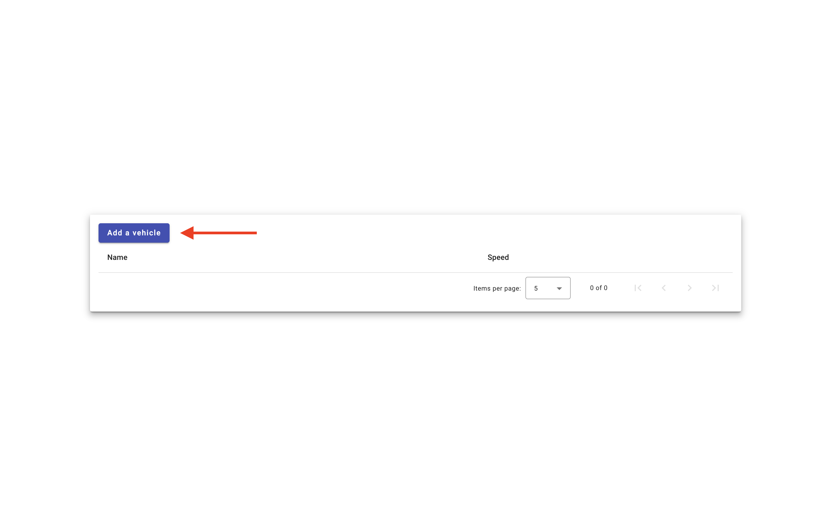
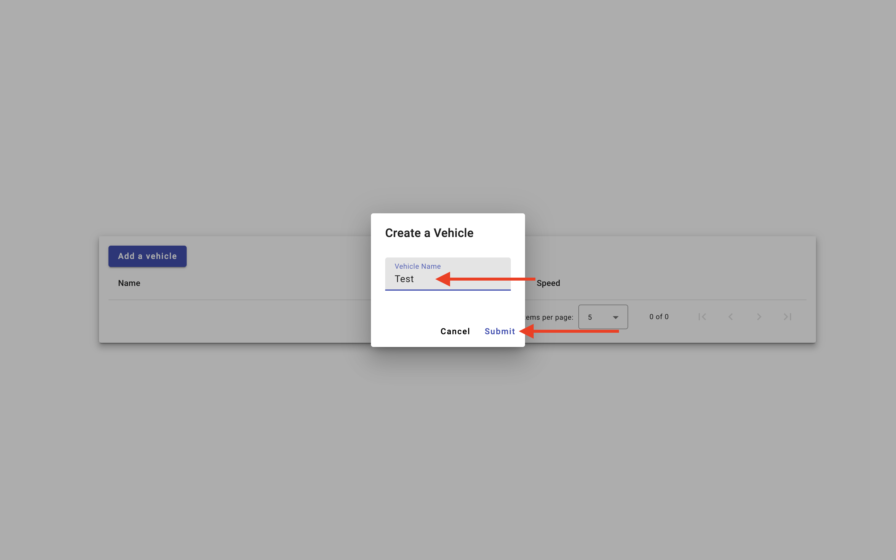
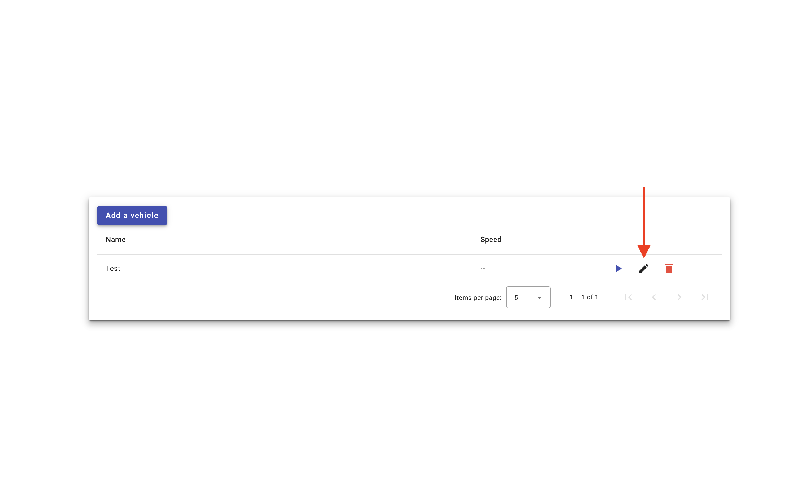
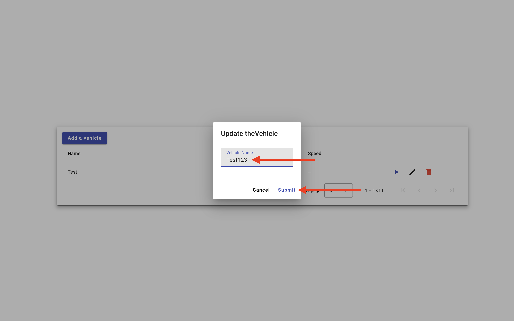
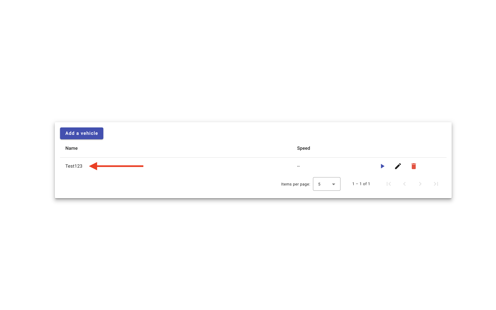
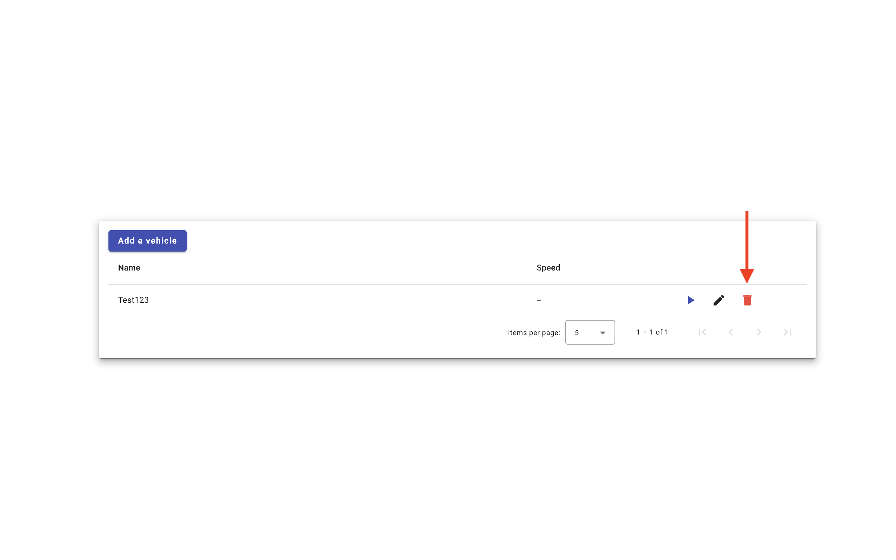
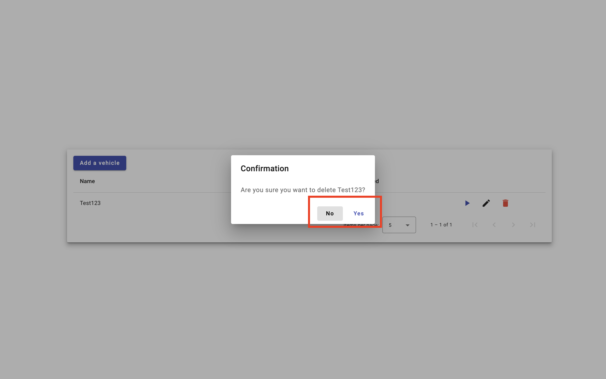
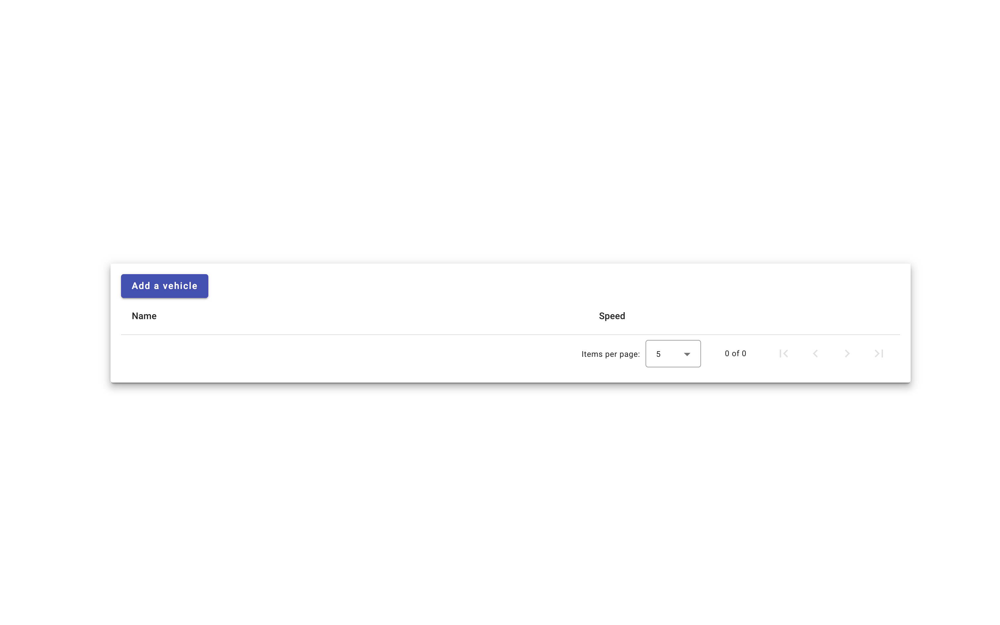
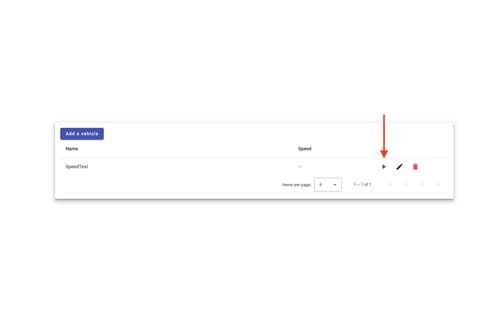
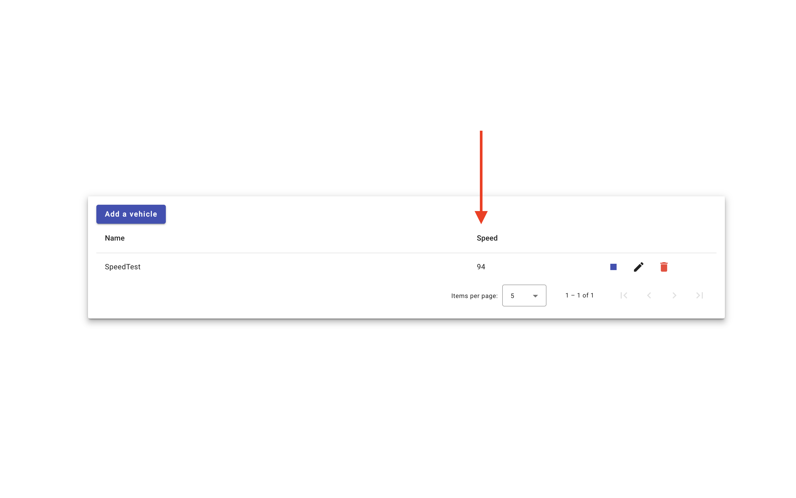

# Lilee T-Cloud Fullstack Engineer Assignment

| Author: Preston Tseng

## Getting Started

Step 1. Run Docker Compose

```
$ docker compose up
```

Step 2. Access the frontend page: [http://localhost:3000](http://localhost:3000)

## Functionality

### Create A Vehicle

1. Click on the “Add a Vehicle” button in the top left corner.

   
2. Enter the name of the vehicle and click “Submit”.

   
3. You can see the added vehicle in the table.

   

### Update The Name Of Vehicle

1. Find the row of the vehicle you want to update and click on the pencil button.
   
2. Update the name of the vehicle in the input field and then click “Submit”. If you decide not to update, please click “Cancel”.

   
3. After clicking "Submit", you can see the updated name of the vehicle in the table.

   

### Delete A Vehicle

1. Find the row of the vehicle you want to delete and click on the trash can button.

   
2. In the confirmation dialog, click “Yes”. If you decide not to delete, please click “No”.

   
3. After clicking "Yes", the vehicle has been deleted.

   

### Real-Time Vehicle Speed Simulation

1. In the row of the vehicle you want to monitor the speed of, click the play button. After clicking, the button will be replaced with a stop button.

   
2. In the speed column, the vehicle’s speed will be updated at a frequency of 1Hz.

   
3. If you want to stop monitoring, please click the stop button. After clicking, the speed field will stop updating.

   
